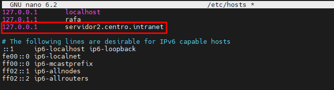

# Índice
**1.** [**Instalación Servidor Apache y Diferentes Dominios**](#id1)

&ensp;&ensp; **1.1.** [**Instalación Servidor Apache**](#id2)

&ensp;&ensp; **1.2.** [**Instalación de MySql y PHP**](#id3)

&ensp;&ensp; **1.3.** [**Configurar Dominios**](#id4)

**2.** [**Instalación y Configuración de WordPress**](#id5)

**3.** [**Instalación y Configuración de Python en Apache**](#id6)

&ensp;&ensp; **3.1.** [**Aplicación Python en página web Apache**](#id7)

&ensp;&ensp; **3.2.** [**Proteger el acceso a la aplicación Python con Autenticación**](#id8)

**4.** [**Instalación y Configuración de AWStats**](#id9)

**5.** [**Instalación Servidor Nginx**](#id10)

# PROYECTO SERVIDOR WEB

### <a name="id1">1. Instalación del servidor web apache. Usaremos dos dominios mediante el archivo hosts: centro.intranet y departamentos.centro.intranet. El primero servirá el contenido mediante wordpress y el segundo una aplicación en Python</a>

&ensp;&ensp; <a name="id2">**1.1. Instalación Servidor Web Apache**</a>

Antes de empezar a instalar nuestro servidor web Apache, debemos actualizar el sistema, para ello usamos estas dos simples instrucciones.
```bash
sudo apt update || apt upgrade
```

Una vez actualizado nuestro servidor, vamos a proceder a instalar el servidor web apache y comprobamos que se ha instalado correctamente.
```bash
sudo apt install apache2 -y
```
```bash
systemctl status apache2
```

Vemos que podemos entrar sin ningún tipo de problema.


&ensp;&ensp; <a name="id3">**1.2. Instalación de MySql y PHP**</a>

Para instalar MySql vamos a ejecutar el siguiente comando
```bash
sudo apt install mysql-server
```

Una vez instalado, para saber si lo hicimos correctamente ponemos en la linea de comandos la siguiente instrucción
```bash
mysql
```

A continuación, vamos a pasar a instalar PHP, para ellos ejecutamos el sigueinte comando para instalar algunas librerias necesarias
```bash
apt install php libapache2-mod-php php-mysql
```

Comprobamos que se ha instalado correctamente viendo la version de PHP que hemos instalado
```bash
php -v
```

&ensp;&ensp; <a name="id4">**1.3. Configurar Dominios**</a>

Para crear un dominio tenemos que dirigirnos al fichero **/etc/hosts**, una vez ahí, debemos poner nuestra ip local y el nombre del dominio que queremos crear, como en el siguiente ejemplo

```bash
sudo nano /etc/hosts
```


### <a name="id5">2. Instalación y Configuración de WordPress</a>

Para la instalación correcta de Wordpress, tenemos que dirigirnos **/var/www/html/**, una vez dentro, debemos crear un directorio donde se va almacenar nuestra página de Wordpress

```bash
sudo mkdir /var/www/html/pagWordPress
```

El segundo paso que debemos seguir, es crear el fichero de configuracion de nuestra página Wordpress. Para ello, nos dirigimos a **/etc/apache2/sites-available/centro.intranet.conf**, en mi caso el nombre del fichero es el nombre de mi dominio + .conf

```bash
sudo nano /etc/apache2/sites-available/centro.intranet.conf
```

Y ponemos el siguiente contenido

```apache
<VirtualHost *:80>
  ServerName centro.intranet
  ServerAlias centro.intranet
  ServerAdmin webmaster@localhost
  DocumentRoot /var/www/html/pagWordPress
  
<Directory /var/www/html/padWordPress/>
  AllowOverride All
</Directory>

ErrorLog ${APACHE_LOG_DIR}/pagWordPress_error.log
CustomLog ${APACHE_LOG_DIR}/pagWordPress_access.log combined
</VirtualHost>
```

Cuando hemos creado un nuevo fichero .conf en los directorios de configuracion de apache, debemos comprobar si no hay ningun error sintáctico en la configuración, habilitar el nuevo modulo que hemos creado y reiniciar apache

```bash
a2ensite centro.intranet
```
```bash
apache2ctl configtest
```
```bash
systemctl restart apache2
```

A continuación, vamos a ejecutar algunos comandos en mysql para crear una base de datos y un usuario administrador para Wordpress. Para ello, entramos en mysql

```bash
mysql
```

Una vez dentro, vamos a crear la base de datos para Wordpress, en mi caso se llamará **wordpress**

```mysql
CREATE DATABASE wordpress DEFAULT CHARACTER SET utf8 COLLATE utf8_unicode_ci;
```

Creamos el usuario administrador, en este caso, se llamará **wordpressuser**

```mysql
CREATE USER 'wordpressuser'@'%' IDENTIFIED WITH mysql_native_password BY '123';
```

Por último, vamo a asignarle los permisos correspondientes

```mysql
GRANT ALL ON wordpress.* TO 'wordpressuser'@'%';
```
```mysql
FLUSH PRIVILEGES;
```

Para salir de mysql ponemos

```mysql
exit;
```

Una vez configurada la base de datos de nuestra página de Wordpress, vamos a instalar algunos modulos de PHP necesarios para la creacion de la página

```bash
sudo apt install curl php-curl php-gd php-mbstring php-xml php-xmlrpc php-soap php-intl php-zip -y
```

Reiniciamos apache de nuevo para guardar todos los cambios

```bash
systemctl restart apache2
```

Vamos a empezar con la instalación de Wordpress. Vamos a dirigirnos a un directorio temporal para instalar todas las librerias de Wordpress

```bash
cd /tmp
```
```bash
sudo curl -O https://wordpress.org/latest.tar.gz
```

Lo descomprimimos

```bash
tar xzvf latest.tar.gz
```

Y creamos el archivo .htaccess para que podamos acceder a la página y no nos de el famoso error **Forbidden**

```bash
touch /tmp/wordpress/.htaccess
```

Copiamos la plantilla de configuración al fichero config.php

```bash
cp /tmp/wordpress/wp-config-sample.php /tmp/wordpress/wp-config.php
```

Creamos el directorio para actualizaciones de Wordpress y copiamos Wordpress a la carpeta web para nuestro proyecto

```bash
mkdir /tmp/wordpress/wp-content/upgrade
```
```bash
sudo cp -a /tmp/wordpress/. /var/www/html/pagWordPress
```

Aplicamos los siguientes permisos a la carpeta de nuestra web
```bash
sudo chown -R www-data:www-data /var/www/html/pagWordPress
sudo find /var/www/html/pagWordPress -type d -exec chmod 750 {} \;
sudo find /var/www/html/pagWordPress -type f -exec chmod 640 {} \;
```

A continuación, vamos a generar unas claves necesarias para ponerlas en un archivo de cofiguracion de Wordpress. Para ello, ejecutamos el siguiente comando y copiamos todo el contenido resultante

```bash
curl -s https://api.wordpress.org/secret-key/1.1/salt/
```

```bash
define('AUTH_KEY','XCg6.;1>5A@w!%?:M[+.;SyD?U030|iv^*]D2dR-`@GL82_C*Yv^$aQ6}dg)IeFi');
define('SECURE_AUTH_KEY','G=vlH7{ZBy6!7(PJ{S4<F~Doo_wS67]4,sN;-k@&-R%QWa$/SHr|BEZDGm;5LC~#');
define('LOGGED_IN_KEY','$[Cooii&tfwggfy+]#JT8I;;oh9u*CQTDwTazhzn[9]mfBu,@YR]bz!0]W|Swsx');
define('NONCE_KEY','ubu]6N0Z%sJ~e(<M+ODOR|J[6ZprN}6C]]nPxq72P{fBB+RZ9!98;zsak8tJt-H');
define('AUTH_SALT','alo^Wpd72|eZ|M+MBxqC/;VdsFFS${*q2bc@hpU0=;,,~0Dn1H8YD4eYO|at-1');
define('SECURE_AUTH_SALT','F>E!OTTZ-5T+Qj4+15r?huI(>CS@vin]tj1zSr0*TAtn~Zzk:SB3+erZV GDV^');
define('LOGGED_IN_SALT','pa^5zh1/[k=[N{57*KjiP4esb-UtGpV*ziVk-d,3loJ[m]u;u%7k#xPR%Pb+N((');
define('NONCE_SALT','04M1C(0;010;jhXj(;4p5zx0s;;az^D00;P91Ycwuez'sh@&c<0)[_AP7B$!t8');
```

Vamos a configurar el fichero **wp-config.php** y ponemos los datos de la base de datos creada anteriormente

```bash
define('DB_NAME','wordpress');
define('DB_USER','wordpressuser');
define('DB_PASSWORD','123');
define('DB_HOST','localhost');
```

Copiamos las claves que hemos generado automaticamente en el archivo. Por último, añadimos al final del fichero la siguiente linea

```bash
define('FS_METHOD','direct');
```

Ya tendriamos WordPress instalado en nuestro servidor web Apache, para acceder a él, en mi caso, accedemos a http://centro.intranet


Cuando seleccionemos un lenguaje y demos en continuar, nos mandará a otra página donde tendremos que introducir un titulo para nuestro sitio, un nombre de usuario, una contraseña y un correo electrónico. Una vez introducido los datos, pulsamos en **Instalar WordPress**


La siguiente página que veremos es el login de Wordpress donde introduciendo los datos anteriores deberemos acceder a nuestro panel de configuración de la página


Ya tendriamos nuestra página web en WordPress operativa


### <a name="id6">3. Instalación y Configuración de Python en Apache</a>

Para instalar Python en nuestro servidor Apache deberemos instalar unas librerias wsgi

```bash
sudo apt install libapache2-mod-wsgi-py3
```


Una vez instalado, habilitamos el módulo wsgi

```bash
a2enmod wsgi
```

&ensp;&ensp; <a name="id7">**3.1. Aplicación Python en página web Apache**</a>

Para realizar esto, vamos a necesitar el modulo mod_wsgi anteriormente habilitado, por si no tenemos Python instaaldo en nuestro servidor, ejecutaremos el siguiente comando

```bash
sudo apt install python3 libexpat1 -y
```
Una vez listo, vamos a iinstalar los paquetes necesarios

```bash
sudo apt install apache2 apache2-utils ssl-cert libapache2-mod-wsgi-py3 -y
```

Cuando tengamos todo listo, podemos crear el codigo de nuestrao archivo python, en mi caso lo llamaré **app.py**

```bash
sudo nano /var/www/html/pagPython/app.py
```

Tendrá el siguiente contenido

```python
def application(environ, start_response):
    status = '200 OK'
    output = b'Pagina de Rafael Hinestrosa'
    response_headers = [('Content-type', 'text/plain'),
                        ('Content-Length', str(len(output)))]
    start_response(status, response_headers)
    return [output]
```

Ahora le asignaremos los permisos necesarios para ser ejecutada

```bash
sudo chown www-data:www-data /var/www/html/pagPython/app.py
sudo chmod 775 /var/www/html/pagPython/app.py
```

A continuación, pasaremos a configurar wsgi creando un nuevo virtual host en nuestro servidor, para ello, copiaremos el contenido del archivo **000-default.conf**

```bash
cp /etc/apache2/sites-available/000-default.conf /etc/apache2/sites-available/pagPython.conf
```

Además de todo su contenido, adicionalmente añadiremos las siguiente lineas, dependiendo de las rutas que tengamos

```apache
ServerName departamentos.centro.intranet
ServerAlias departamentos.centro.intranet
DocumentRoot /var/www/html/pagPython/
WSGIScriptAlias /appPython /var/www/html/pagPython/app.py
```

Cuando hayamos editado el fichero, reiniciamos el servidor web

```bash
systemctl restart apache2
```

Ya podemos acceder a nuestro dominio: http://departamentos.centro.intranet/appPython


&ensp;&ensp; <a name="id8">**3.2. Proteger el acceso a la aplicación Python con Autenticación**</a>

Para crear una autenticación en la aplicacion Python, debemos crear un usuario con su contraseña, para ello ejecutamos el siguiente comando

```bash
htpasswd -c /etc/apache2/.htpasswd rafa
```

Cuando hayamos creado el usuario, accedemos a nuestro archivo de configuración **pagPython.conf** y añadimos las siguientes lineas

```apache
<Directory /var/www/html/pagPython>
    AuthType Basic
    AuthName "Area de Seguridad - Autenticación requerida"
    AuthUserFile /etc/apache2/.htpasswd
    Require user rafa rafa123
</Directory>
```

Reiniciamos nuestro servidor

```bash
systemctl restart apache2
```

Accedemos a la página web de Python y nos debe saltar un autenticación


Y ya podriamos acceder al contenido de la página


### <a name="id9">4. Instalación y Configuración de AWStats</a>

Vamos a instalar el paquete AWStats

```bash
sudo apt install awstats
```

Activamos el módulo necesario de **CGI** en Apache

```bash
a2enmod cgi
```

Vamos a crear un archivo de configuración para nuestra web de WordPress cuyo dominio es **centro.intranet**

```bash
sudo cp /etc/awstats/awstats.conf /etc/awstats.centro.intranet.conf
```

Abrimos el fichero que hemos copiado

```bash
sudo nano /etc/awstats.centro.intranet.conf
```

Ponemos nuestro nombre de dominio en el apartado de **SiteDomain**

```apache
SiteDomain="centro.intranet"
```

Cambiamos también el nombre de dominio del sitio web en el apartado de **HostAliases**

```apache
HostAliases="www.centro.intranet localhost 127.0.0.1"
```

Cambiamos el 0 por el 1 en el apartado de **AllowToUpdateStatsFromBrowser**. Esto permite que la página agregue un botón de recarga para actualizar las estadísticas

```apache
AllowToUpdateStatsFromBrowser=1
```

Debemos construir las estadísticas iniciales que se generan a partir de los registros actuales de nuestro servidor

```bash
sudo /usr/lib/cgi-bin/awstats.pl -config=centro.intranet -update
```

Vamos a copiar las estadísticas en el directorio de apache para que nos lo pueda mostrar.

```bash
sudo cp -r /usr/lib/cgi-bin /var/www/html/
```

Asignamos los siguientes permisos

```bash
sudo chown www-data:www-data /var/www/html/cgi-bin/
sudo chmod -R 755 /var/www/html/cgi-bin/
```

Una vez realizado estos pasos, ya tendriamos AWStats funcionando correctamente. Para acceder a él, en mi caso, localhost/cgi-bin


Por último, vamos a crear una tarea con contrab para que las estadísticas se actualicen regularmente. Accedemos a el fichero **/etc/crontab** y ponemos la siguiente linea

```apache
*/10 * * * * * root /usr/lib/cgi-bin/awstats.pl -config=test.com -update
```

### <a name="id10">5. Instala un segundo servidor de tu elección (nginx, lighttpd) bajo el dominio “servidor2.centro.intranet”. Debes configurarlo para que sirva en el puerto 8080 y haz los cambios necesarios para ejecutar php. Instala phpmyadmin.</a>

&ensp;&ensp; <a name="i11">**5.1. Instalación del Servidor Nginx**</a>

Para instalar un servidor Nginx debemos ejecutar el siguiente comando

```bash
sudo apt install nginx
```

Para comprobar que lo hemos instalado correctamente ejecutamos

```bash
systemctl status nginx
```

Accedemos a localhost y deberiamos tener un pantalla como esta


&ensp;&ensp; <a name="i12">**5.2. Cambiar puerto del servidor Nginx**</a>

Para cambiar el puerto de escucha de nuestro servidor debemos acceder a **/etc/nginx/sites-availables/default**

```bash
sudo nano /etc/nginx/sites-availables/default
```

En las dos lineas donde de **Listen** cambiamos el puerto por defecto, 80, al puerto 8080


Reiniciamos el servidor Nginx

```bash
systemctl restart nginx
```

Por último, vamos a asignarle un dominio a nuestro servidor para poder acceder más facilmente y bajo un nombre de dominio



Ahora podemos acceder a nuestro servidor, en mi caso, con http://servidor2.centro.intranet:8080


&ensp;&ensp; <a name="i13">**5.3. Instalación de phpmyadmin**</a>

Vamos a instalar algunas librerias necesarias de php necesarias

```bash
sudo apt install php libapache2-mod-php php-mysql
```

Verficamos que php se insalo correctamente

```bash
php -v
```


