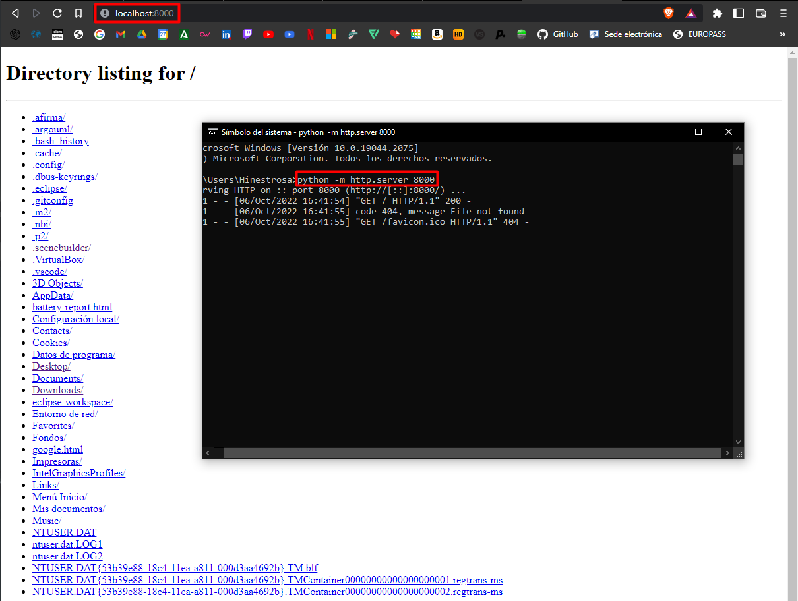
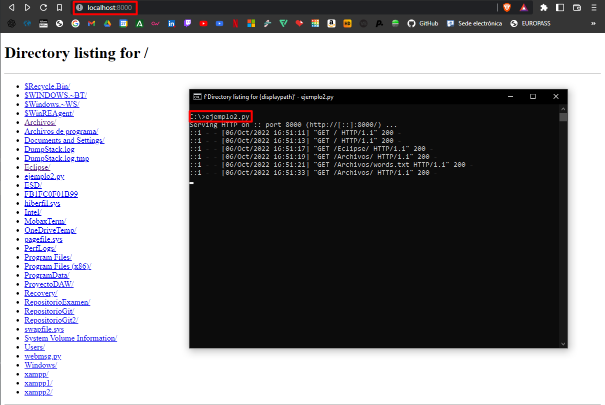
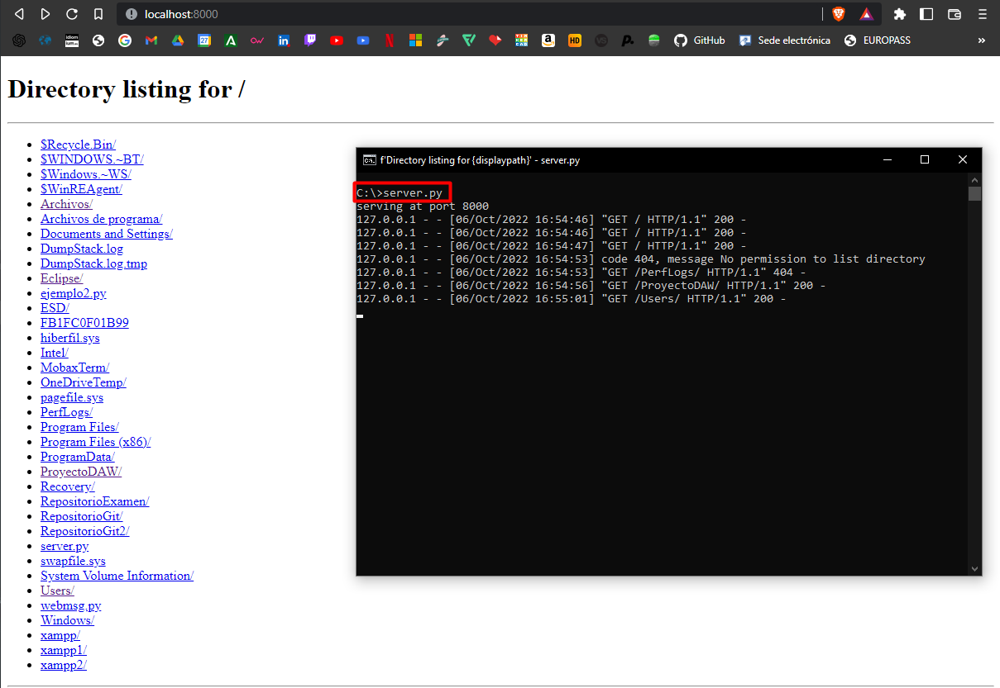

# Práctica Servidor Web

### Simple web Server

python -m http.server 8000

### Http Server

Archivo descargado de GitHub, lo puedes descargar [aquí](img/ejemplo2.py)

### Dummy Web Server

Archivo descargado de GitHub, lo puedes descargar [aquí](img/server.py)

